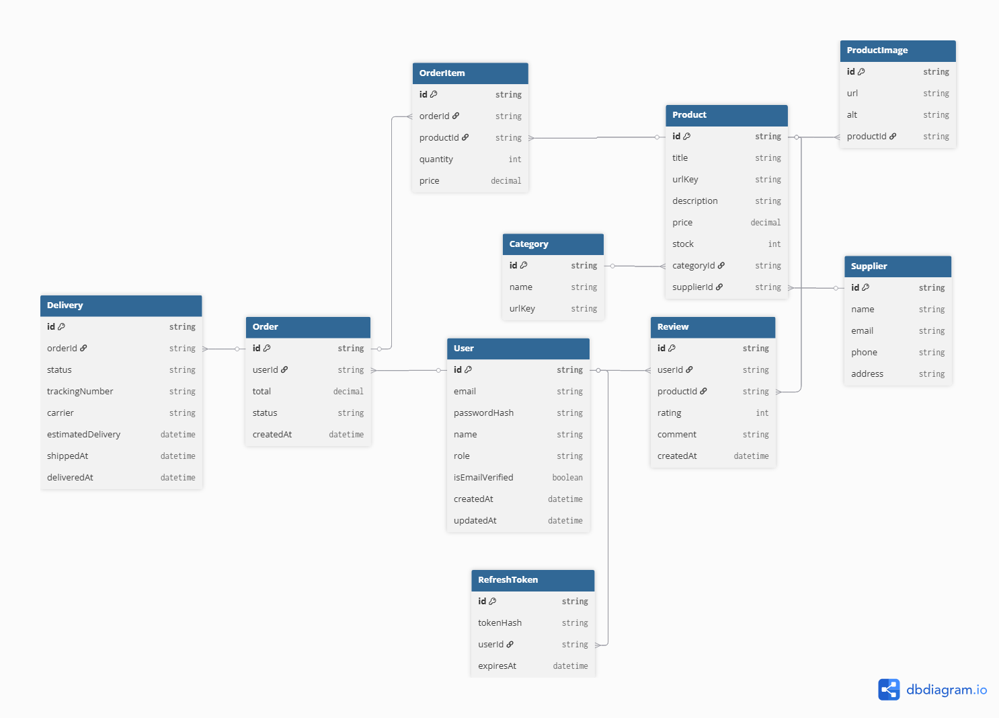

# 🏪 **Office Server**

Серверная часть интернет-магазина офисных товаров.
Реализует авторизацию, управление товарами, заказами и пользователями.

## 🖼 **Диаграмма проекта**

---

## 📦 **Сущности и их назначение**

### 🧾 **OrderItem**

> Хранит отдельные позиции (товары) внутри заказа (`Order`).

Каждая запись соответствует одному товару, добавленному в заказ,
и фиксирует **цену на момент покупки** и **количество**.

Несколько записей `OrderItem` формируют один `Order` (заказ).
Это нужно, чтобы сохранять историю заказов даже при изменении цен на товары.

### 🔐 **RefreshToken**

> Используется для безопасного продления сессии пользователя без повторного входа.

При авторизации сервер выдаёт два токена:

* **Access Token** — живёт 15–30 минут, используется для обычных запросов;
* **Refresh Token** — живёт дольше, позволяет получить новый Access Token, когда старый истёк.

Оба токена хранятся в **httpOnly cookie** для защиты от XSS-атак.

---

#### 🗄️ Почему хранится в базе

Хотя refresh-токен уже есть в cookie, запись в базе данных нужна для:

* 🛡️ **Контроля и безопасности** — можно отозвать или деактивировать токен при выходе.
* 📱 **Поддержки нескольких устройств** — у пользователя может быть несколько активных токенов.
* 🔁 **Ротации токенов** — при обновлении выдается новый, старый становится недействительным.
* 🚫 **Защиты от кражи** — украденный токен не сработает, если он помечен `revoked` в БД.

Такой подход немного увеличивает нагрузку на базу,
но значительно повышает **безопасность и управляемость сессий**.
